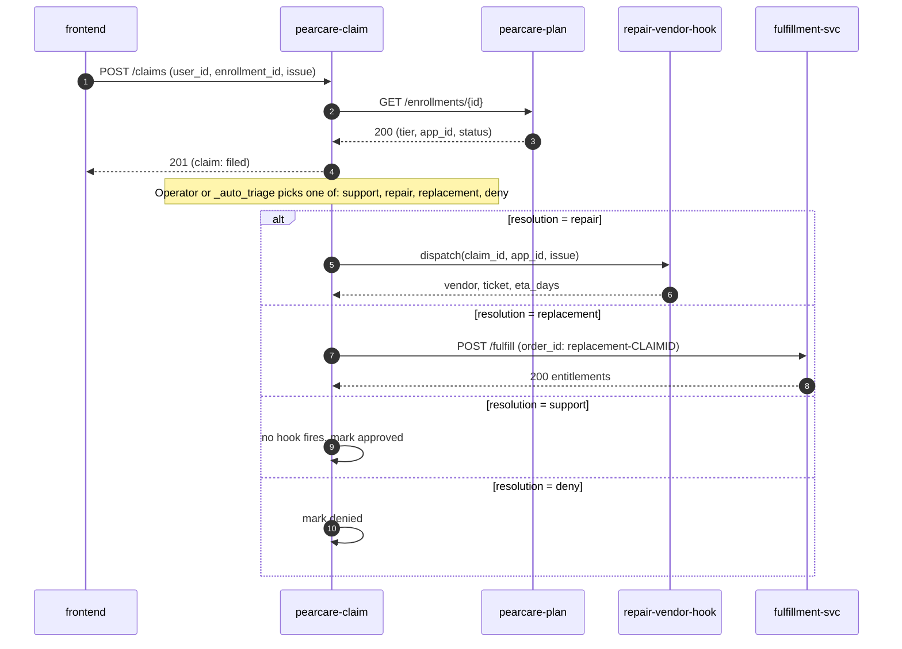

# Data flow: a PearCare claim

User has an active enrollment and something has gone wrong.

## Sequence

## Triage rules (default, `_auto_triage` in `claim/app.py`)

This is intentionally simple — real eligibility logic should live here.

| Issue keywords                              | Required tier      | Result        |
| ------------------------------------------- | ------------------ | ------------- |
| "lost", "stolen", "theft"                   | pearcare_loss      | replacement   |
| "lost" / "stolen" without loss tier         | any                | deny          |
| "broken", "damage", "cracked", "crash"      | any                | repair        |
| "question", "how do", "help", "setup"       | any                | support       |
| anything else                               | any                | support       |
