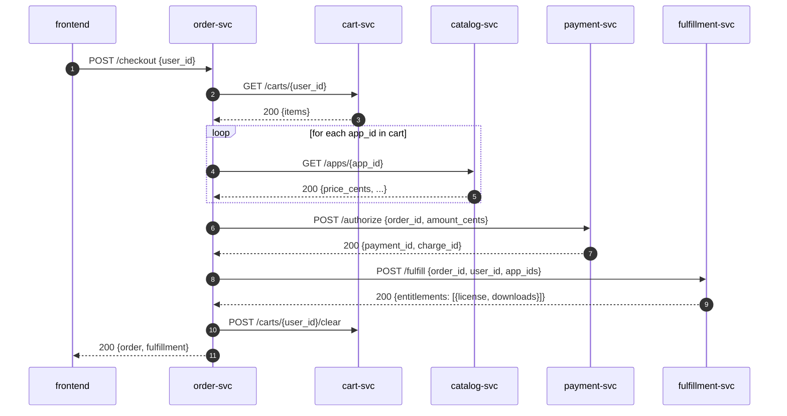

# Data flow: a purchase

This document walks one user transaction end-to-end so a future
developer can match log lines to specific service calls.

## Setup

* User is signed in (cookie holds `{id, email, display_name}`).
* User has at least one app in their cart.

## Sequence

## Failure modes

* **Empty cart** → order-svc returns `400`. No payment is attempted.
* **Payment declined** → order-svc returns `402` with the provider error.
  The order is created and persisted in `failed` state for audit.
* **Fulfillment fails** → currently raises and the order is left in
  `paid` state. *Known gap*: the order is not refunded automatically;
  a human runs `POST /orders/<id>/refund`. Document this in the
  incident runbook.

## State invariants

* Every paid order has exactly one `payment_id` from payment-svc.
* Every fulfilled order has exactly one receipt in fulfillment-svc.
* `order.total_cents` is the sum of `catalog.price_cents` at the moment
  of checkout; if catalog prices change later, the order is unaffected.

## What is not in this system

<!-- SME-PLACEHOLDER:q-sd-ce4624896a START -->
> ⏳ **Waiting for SME** — *Topic:* What is not in this system
>
> *Question:* What non-goals or out-of-scope work are explicitly excluded from this purchase data flow?
> *Best guess (low-confidence):* (none)
> *Asked:* on 2026-06-27 · *Status:* pending · *Question ID:* `q-sd-ce4624896a`
<!-- SME-PLACEHOLDER:q-sd-ce4624896a END -->

## Why this shape

The design rationale for splitting services in a purchase transaction involves multiple participants and a sequence of interactions. According to the data flow diagram [S1](data-flow-pearcare-claim.md), when a user initiates a claim, the frontend (FE) sends a POST request to the PearCare Claim service (CL), which then retrieves enrollment information from the PearCare Plan service (PL). The CL service then determines the resolution type (support, repair, replacement, or deny) and triggers the corresponding hook.

For repair resolutions, the CL service dispatches a request to the Repair Vendor Hook (RV), which returns vendor, ticket, and eta_days information. For replacement resolutions, the CL service sends a POST request to the Fulfillment Service (FUL) with an order ID for replacement, receiving entitlements in response. The triage rules [S1](data-flow-pearcare-claim.md) specify that real eligibility logic should live here, but the default rules are intentionally simple.

The services are split as follows:

* PearCare Claim (CL): handles claim filing and resolution determination
* PearCare Plan (PL): provides enrollment information
* Repair Vendor Hook (RV): dispatches repair requests to vendors
* Fulfillment Service (FUL): processes replacement orders

This design allows for modular, service-oriented architecture, where each service has a specific responsibility and can be developed and maintained independently.
