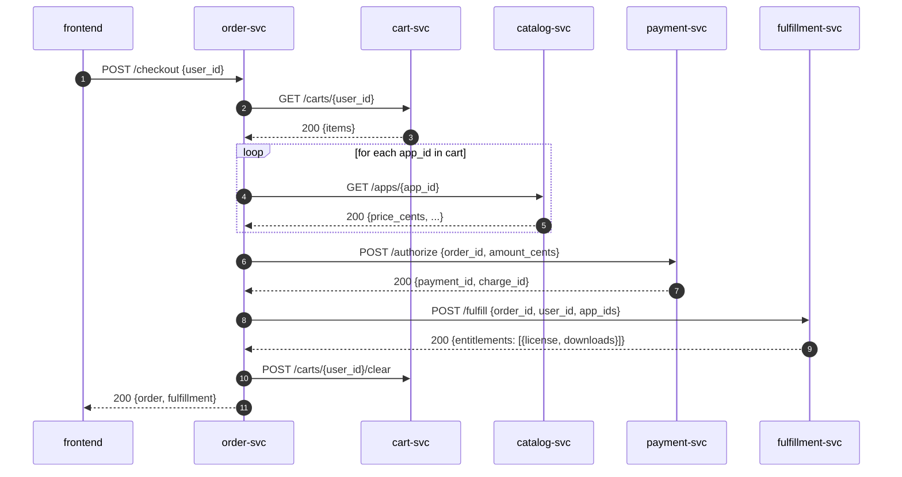

# Data flow: a purchase

This document walks one user transaction end-to-end so a future
developer can match log lines to specific service calls.

## Setup

* User is signed in (cookie holds `{id, email, display_name}`).
* User has at least one app in their cart.

## Sequence

## Failure modes

* **Empty cart** → order-svc returns `400`. No payment is attempted.
* **Payment declined** → order-svc returns `402` with the provider error.
  The order is created and persisted in `failed` state for audit.
* **Fulfillment fails** → currently raises and the order is left in
  `paid` state. *Known gap*: the order is not refunded automatically;
  a human runs `POST /orders/<id>/refund`. Document this in the
  incident runbook.

## State invariants

* Every paid order has exactly one `payment_id` from payment-svc.
* Every fulfilled order has exactly one receipt in fulfillment-svc.
* `order.total_cents` is the sum of `catalog.price_cents` at the moment
  of checkout; if catalog prices change later, the order is unaffected.
