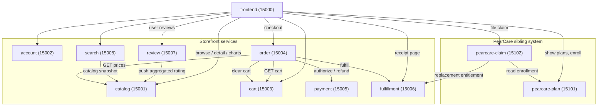

# Architecture overview

Pear Store is a small, deliberately fragmented digital storefront. It is
organized into ten self-contained Flask services plus one frontend, each
owning one chunk of the user journey. The system is split into two product
areas — the **storefront** (browse, buy, install) and **PearCare** (warranty
plans and claims) — so that PearCare can evolve and be deployed
independently of the rest of the store.

## Service map

## Ownership boundaries

* **catalog** owns app metadata. Everything else treats catalog as the
  source of truth and fetches by `app_id` on demand. Catalog also accepts
  rating updates from review-svc; ratings are denormalized onto the catalog
  record so search can rank without a join.
* **search** is read-only. It rebuilds its in-memory index from the
  catalog on each query (a real system would subscribe to a change feed).
* **account** owns user identity. The demo stores plaintext passwords on
  purpose so the surface area stays tiny; a production replacement is
  out of scope here.
* **cart** is per-user, ephemeral, idempotent. It is the only piece of
  state that survives across navigation but does not survive a restart.
* **order** is the orchestrator for checkout. It is the only service
  that talks to **payment** and **fulfillment**, so the state machine
  for "pending → paid → fulfilled" lives in exactly one place.
* **payment** wraps three provider hooks (`stripe`, `paypal`,
  `pearcard`). Picking a provider is done by token prefix.
* **fulfillment** mints licenses and per-platform download URLs. It is
  reused from PearCare's claim service when a claim resolves to a
  replacement.
* **review** owns ratings and free-text reviews and *pushes* aggregate
  ratings back into catalog so search can use them.
* **PearCare plan** owns warranty plan definitions and per-user
  enrollments. It does not store anything about claims.
* **PearCare claim** owns the claim lifecycle (`filed → triaged →
  approved | denied`). Approval fans out to either a vendor-repair hook
  or the main fulfillment service for replacement entitlements.

## Why this shape

* **One orchestrator** (order-svc) means there is exactly one place
  where checkout's failure semantics live.
* **Push, don't pull, for ratings.** Catalog could call review on every
  read, but reads are 100x more common than rating updates. Review pushes
  the aggregate every time a new review lands.
* **PearCare reuses fulfillment.** A "replacement" claim is, mechanically,
  a free re-purchase. Reusing fulfillment-svc means licenses, receipts,
  and the user's library all stay consistent without bespoke code.
* **No real database.** Every service uses module-level dicts. Restart
  loses state. This is the right call for synthetic-data generation; do
  not extend it for real workloads.

## What is not in this system

* Webhooks back to developers when their app sells. Out of scope.
* Tax / VAT calculation. Prices in `price_cents` are pre-tax.
* Family Sharing, gift cards, redeem codes.
* Real auth: no OAuth, no JWT, no rate limiting.
* Observability: no metrics, traces, or structured logs. Each service
  writes Flask's stdout to `logs/<svc>.log`.
