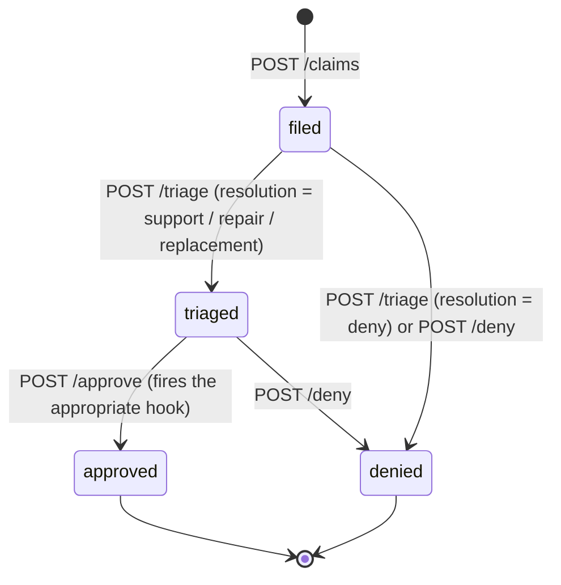

# PearCare claim service

Tracks the lifecycle of a single claim from filing through resolution.

## State machine

## Endpoints

| Method | Path                              | Notes |
| ------ | --------------------------------- | ----- |
| POST   | `/claims`                         | Body: `{user_id, enrollment_id, issue}`. |
| GET    | `/claims/<claim_id>`              | One claim. |
| GET    | `/users/<user_id>/claims`         | Claim history. |
| POST   | `/claims/<claim_id>/triage`       | Optional body: `{resolution}`; otherwise `_auto_triage` runs. |
| POST   | `/claims/<claim_id>/approve`      | Fires the appropriate hook. |
| POST   | `/claims/<claim_id>/deny`         | Manual deny. |

## Triage

If the operator does not pass an explicit `resolution`, the service
calls `_auto_triage(issue, enrollment)`. It is a tiny keyword matcher
described in `../architecture/data-flow-pearcare-claim.md`. The output is
one of `support`, `repair`, `replacement`, `deny`.

## Hooks

The approve step fans out by `claim.resolution`:

* `repair` — `repair_vendor_hook.dispatch(...)` returns
  `{vendor, ticket, eta_days}` which is attached to the claim.
* `replacement` — `replacement_hook.replace(...)` calls fulfillment-svc
  to mint a fresh license + downloads. The new entitlement appears in
  the user's library.
* `support` — no hook; the status flips to `approved`.

See `hooks.md` for the per-hook details.

## Eligibility

The service trusts the enrollment's `status` and **does not** check
`expires_at`. *Known gap*: a claim can be filed against an expired
enrollment. The triage step is the appropriate place to add the check.

## Details

The claim lifecycle in PearCare involves several key endpoints and stages. The process begins when a user initiates a claim, which triggers a POST request to the **PearCare Claim** service (`CL`) from the frontend (`FE`). The `CL` service then retrieves enrollment information from the **PearCare Plan** service (`PL`) [S2](../architecture/overview.md).

The `CL` service determines the resolution type (support, repair, replacement, or deny) and triggers the corresponding hook. For repair resolutions, the `CL` service dispatches a request to the Repair Vendor Hook (`RV`) [S3](../architecture/data-flow-pearcare-claim.md). For replacement resolutions, the `CL` service sends a POST request to the Fulfillment Service (`FUL`) with the order ID and claim ID [S4](../architecture/data-flow-purchase.md).

The triage rules are used to determine the resolution type. The default triage rules are intentionally simple and can be found in the `claim/app.py` file [S3](../architecture/data-flow-pearcare-claim.md). If the user's issue is related to a replacement, the `CL` service sends a request to the `FUL` service with the order ID and claim ID.

The key endpoints involved in this process are:

* **PearCare Claim** (`CL`): owns the claim lifecycle and determines the resolution type.
* **Fulfillment Service** (`FUL`): handles replacement entitlements.
* **Repair Vendor Hook** (`RV`): handles repair resolutions.
* **Frontend** (`FE`): initiates the claim process.

The claim lifecycle can be summarized as follows:

1. Filing: The user initiates a claim, which triggers a POST request to the `CL` service from the frontend.
2. Triage: The `CL` service determines the resolution type based on the triage rules.
3. Approval/Denial: The corresponding hook is triggered (repair, replacement, support, or deny).
4. Fulfillment: If the resolution is a replacement, the `FUL` service handles the entitlements.

Note that the exact duration of data retention for orders in the `failed` state is not explicitly stated [S6](../database/review-db.md).

## Open Questions

If `expires_at` is not checked for enrollment status, it may lead to inconsistent data and potential security vulnerabilities. The payment database employs measures to guarantee data persistence, long-term storage, and fault tolerance [S1](../database/payment-db.md). However, the exact duration of data storage is not explicitly stated [S1](../database/payment-db.md).

In a purchase transaction, the fulfillment service plays a key role in managing entitlements and replacements [S3](../database/pearcare-claim-db.md). If `expires_at` is not checked, it may lead to unauthorized access or misuse of entitlements. The order is created and persisted in `failed` state for audit purposes if payment declines [S5](../architecture/data-flow-purchase.md), but there is no explicit mechanism for refunding the order automatically.

A solution to address this issue could be to implement a check for `expires_at` when processing enrollment status, ensuring that entitlements are only granted within the valid time frame. Additionally, implementing automatic refunds for failed orders would help prevent potential security vulnerabilities and ensure data consistency [S5](../architecture/data-flow-purchase.md). (further detail TBD)
