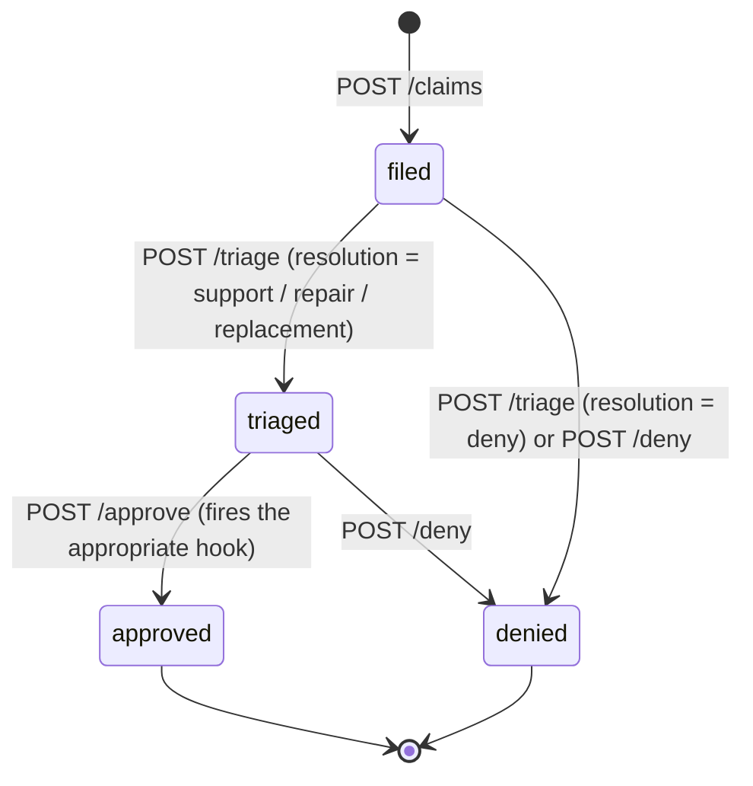

# PearCare claim service

Tracks the lifecycle of a single claim from filing through resolution.

## State machine

## Endpoints

| Method | Path                              | Notes |
| ------ | --------------------------------- | ----- |
| POST   | `/claims`                         | Body: `{user_id, enrollment_id, issue}`. |
| GET    | `/claims/<claim_id>`              | One claim. |
| GET    | `/users/<user_id>/claims`         | Claim history. |
| POST   | `/claims/<claim_id>/triage`       | Optional body: `{resolution}`; otherwise `_auto_triage` runs. |
| POST   | `/claims/<claim_id>/approve`      | Fires the appropriate hook. |
| POST   | `/claims/<claim_id>/deny`         | Manual deny. |

## Triage

If the operator does not pass an explicit `resolution`, the service
calls `_auto_triage(issue, enrollment)`. It is a tiny keyword matcher
described in `../architecture/data-flow-pearcare-claim.md`. The output is
one of `support`, `repair`, `replacement`, `deny`.

## Hooks

The approve step fans out by `claim.resolution`:

* `repair` — `repair_vendor_hook.dispatch(...)` returns
  `{vendor, ticket, eta_days}` which is attached to the claim.
* `replacement` — `replacement_hook.replace(...)` calls fulfillment-svc
  to mint a fresh license + downloads. The new entitlement appears in
  the user's library.
* `support` — no hook; the status flips to `approved`.

See `hooks.md` for the per-hook details.

## Eligibility

The service trusts the enrollment's `status` and **does not** check
`expires_at`. *Known gap*: a claim can be filed against an expired
enrollment. The triage step is the appropriate place to add the check.
