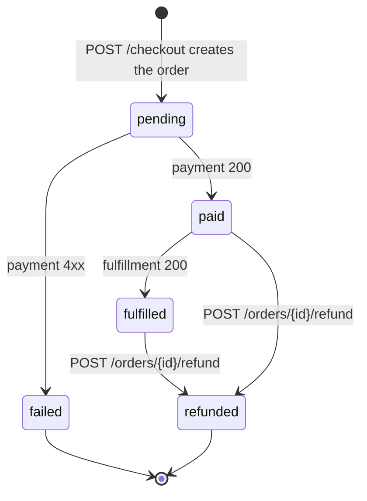

# Order service

The orchestrator for every purchase. The frontend talks only to
order-svc to check out — it does not call payment or fulfillment
directly. This is the only place where the checkout state machine
lives, which keeps "what does it mean to be paid?" pinned to one
codebase.

## State machine

## Endpoints

| Method | Path                            | Notes |
| ------ | ------------------------------- | ----- |
| POST   | `/checkout`                     | Body: `{user_id}`. The big one — see flow doc. |
| GET    | `/orders/<order_id>`            | One order. |
| GET    | `/users/<user_id>/orders`       | Order history. |
| POST   | `/orders/<order_id>/refund`     | Marks refunded; fires payment refund best-effort. |

## Behavior worth knowing

* `total_cents` is computed by re-querying catalog at checkout time, not
  cached on the cart. If a price changes between "added to cart" and
  "checkout", the user pays the price at checkout time.
* On payment failure the order is preserved in `failed` state for
  audit; nothing rolls it back.
* On fulfillment failure the order is currently left in `paid` state.
  See the incident runbook — auto-rollback is a known gap.

## Cross-service contract

* Calls cart-svc with `GET /carts/<user_id>` to read items.
* Calls catalog-svc with `GET /apps/<id>` for every cart item to compute
  the total.
* Calls payment-svc with `POST /authorize`. Treats `>=400` as a hard
  decline.
* Calls fulfillment-svc with `POST /fulfill`. Expects 200.
* Calls cart-svc with `POST /carts/<user_id>/clear` once everything
  succeeds.

## Overview

The primary responsibility of the Order service is to manage the state machine for "pending → paid → fulfilled" transactions. It owns the account database and is responsible for managing user-specific data, including cart information.

Key features of the Order service include:

* Orchestrating interactions with the payment and fulfillment services
* Managing the state machine for "pending → paid → fulfilled" transactions
* Storing user-specific data in the account database

Goals of the Order service include:

* Ensuring seamless checkout experience for users
* Efficiently processing payments and fulfilling orders
* Maintaining accurate and up-to-date information about user carts and orders

The Order service interacts with other services, including the Payment service, Fulfillment Service, and Cart service, to achieve its goals. It also relies on the account database to store and manage user-specific data.

Note that further detail regarding the specific data stored in the account database for each user is TBD [S7](../database/payment-db.md).

## Data model

The primary attributes of an order entity are:

* `id`: The unique ID of the order (integer) [S2](../database/cart-db.md)
* `user_id`: The ID of the user who placed the order (integer) [S2](../database/cart-db.md)
* `total_cents`: The total cost of the order (integer) [S2](../database/cart-db.md)
* `payment_id`: The payment ID associated with the order (string) [S2](../database/cart-db.md)

The information stored about users in this service includes:

* `user_id`: The ID of the user who owns the cart or placed the order (integer) [S2](../database/cart-db.md), [S3](../database/catalog-db.md), [S5](cart.md)
* Cart items: A list of items in the cart, each containing attributes like `app_id`, `quantity`, and `price_cents` (array of objects) [S2](../database/cart-db.md), [S3](../database/catalog-db.md), [S5](cart.md)

## Downstream services

The Order service calls the Cart Service with GET /carts/<user_id> to retrieve the cart contents for the user initiating checkout, which are then used by the Order service to interact with the Payment Service [S5](../database/payment-db.md).

The purpose of calling the Payment Service with POST /authorize is to authorize the payment for the order. The Order service retrieves the cart contents from the Cart Service and uses this information to interact with the Payment Service to retrieve relevant data and complete the payment process [S6](../database/payment-db.md).
