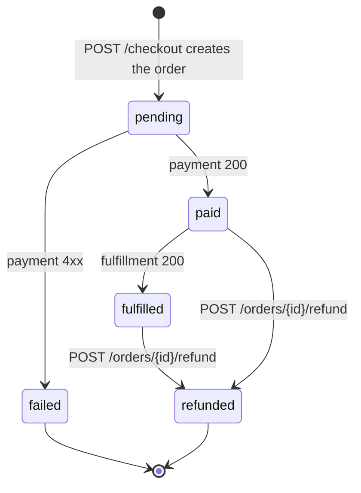

# Order service

The orchestrator for every purchase. The frontend talks only to
order-svc to check out — it does not call payment or fulfillment
directly. This is the only place where the checkout state machine
lives, which keeps "what does it mean to be paid?" pinned to one
codebase.

## State machine

## Endpoints

| Method | Path                            | Notes |
| ------ | ------------------------------- | ----- |
| POST   | `/checkout`                     | Body: `{user_id}`. The big one — see flow doc. |
| GET    | `/orders/<order_id>`            | One order. |
| GET    | `/users/<user_id>/orders`       | Order history. |
| POST   | `/orders/<order_id>/refund`     | Marks refunded; fires payment refund best-effort. |

## Behavior worth knowing

* `total_cents` is computed by re-querying catalog at checkout time, not
  cached on the cart. If a price changes between "added to cart" and
  "checkout", the user pays the price at checkout time.
* On payment failure the order is preserved in `failed` state for
  audit; nothing rolls it back.
* On fulfillment failure the order is currently left in `paid` state.
  See the incident runbook — auto-rollback is a known gap.

## Cross-service contract

* Calls cart-svc with `GET /carts/<user_id>` to read items.
* Calls catalog-svc with `GET /apps/<id>` for every cart item to compute
  the total.
* Calls payment-svc with `POST /authorize`. Treats `>=400` as a hard
  decline.
* Calls fulfillment-svc with `POST /fulfill`. Expects 200.
* Calls cart-svc with `POST /carts/<user_id>/clear` once everything
  succeeds.
